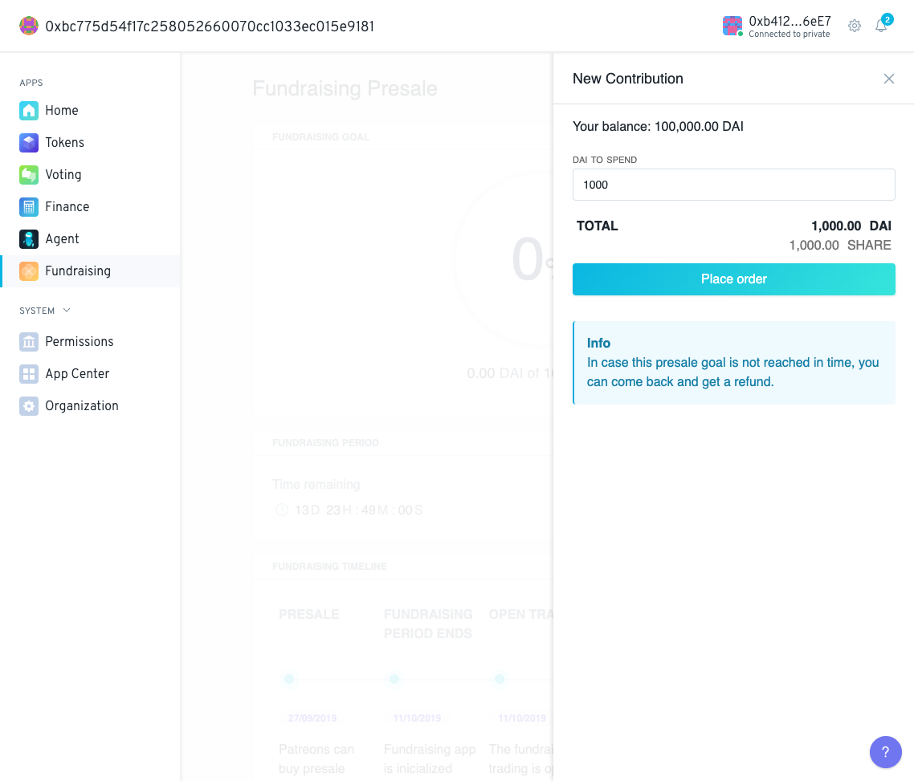

# Pre-sale configuration

Fundraising allows for projects to fund a pre-sale as a way to:

a\) Guarantee a minimum reserve and tap amount

b\) Level the playing field between stakers 

c\) Offer transparency and equal opportunity for fundraising campaigns

d\) Automate curve initialisation by testing campaign metrics against minimum terms

The pre-sale screens enables an individual/DAO to configure it's pre-sale terms, launch and communicate around it. 

**The terms covered  are fields to be completed to configure a fundraising campaign:**

* **Project’s pitch:** a short description of the fundraising campaign.
* **Token Supply Offered:** Which percent of the share token supply is offered to the public. Conversely 100-Token Supply Offered corresponds to the amount of Share token that can be vested over time to Board token holders.
* **Initial Price per token:** A uniform pre-sale share token price is specified. The following formula \(LINK\) helps calculate initial price and trading price once the bonding curve is open to trading.
* **Vesting Schedule:** Over how long of a period are pre-sale tokens distributed to stakers.
* **Cliff Period:** After how long share tokens start vesting to pre-sale stakers.
* **Upfront Costs:** An allocation for upfront investments by the DAO that will be left out of the bonding curve mechanism.
* **Fundraising schedule Preview:** token supply and pice 

Once the fundraising terms have been configured the pre-sale terms are shown in the DAO's Fundraising app page.

Members of the DAO can then click the "Open the pre-sale" button to initiate a vote of BOARD token members.

If by the end of the Voting period a majority of BOARD token members have voted "Yes" the Fundraising campaign starts.

The presale then starts and Fundraising Period window shows the time remaining in the presale while Fundraising timeline displays various informations relate to the sales start and end, trading, cliff period and vesting period.

At this point Patreons can buy Presale Tokens by clicking on the "Buy Presale Tokens" button. This will open a side panel where the patreon can imput the amount of contribution tokens \(DAI and ETH\)  they want to spend in return for SHARE tokens. By inputting various amounts of contribution tokens the Fundraising app computes the corresponding amount of SHARE token based on the configured presale price.

The Patreon then can click the place order button and initiate a transaction to purchase the presale tokens.

As Patreons contribute tokens the Fundraising Goal is updated over time to reflect this.

 When 100% of the target has been reached the bonding curve is then initiated!

