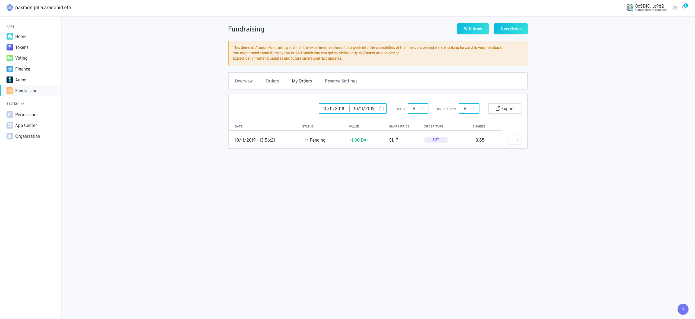
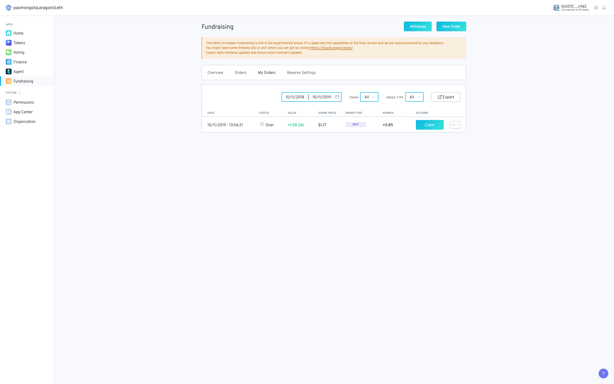
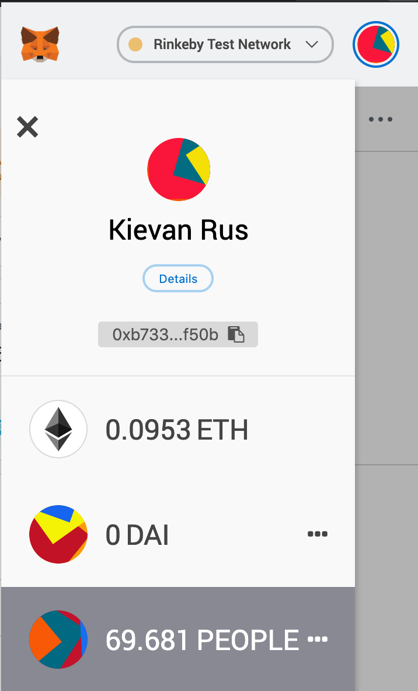

# Orders Status and Orders Claiming

Head to the My Orders tab to check the order status:

While a batch is ongoing the status of the order is pending. Once the batch closes status changes to cancelled if the slippage guard was exceeded or displays over with an ability to click the "Claim button":

A transaction can then be signed to claim the share token. In the overview tab the "Share token address" displays the contract address for the DAOs share token. You can go to metamask or another web 3 provider and copy paste this address in the add custom token contract field to have your tokens show in your wallet:

