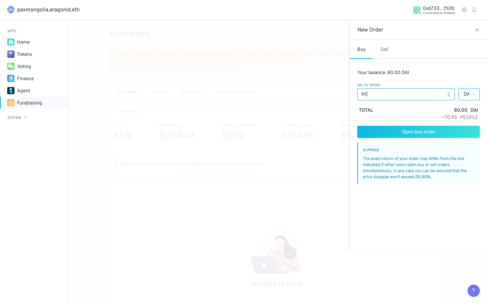
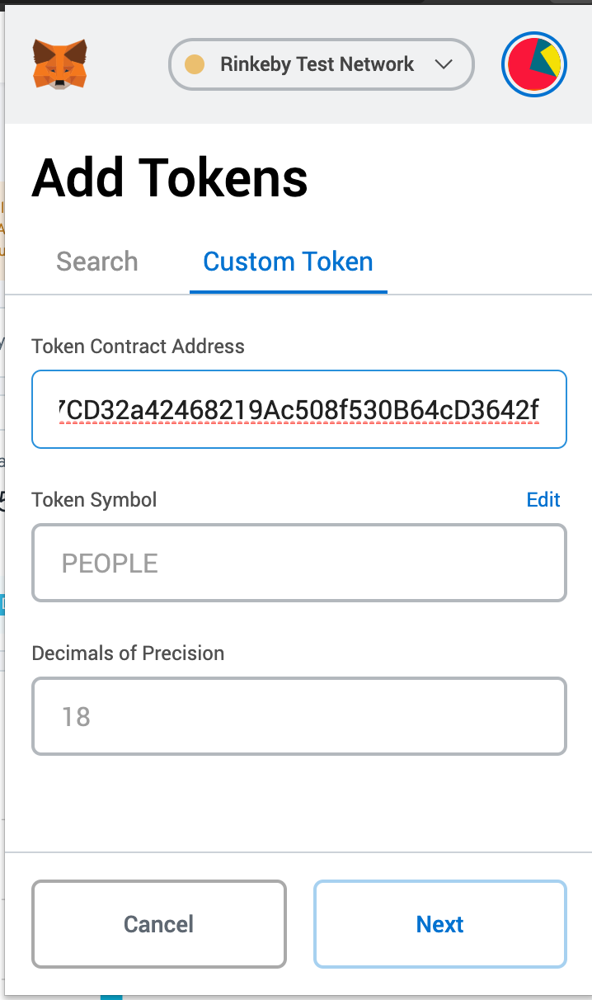

# Placing an order

All tabs in the Fundraising app contain an over-arching "New order" button which can be clicked to initiate a buy or sell order by any user! 

By default there is no white/black list but this can be configured in the permissions which are explained in the advanced guide.

Once the "New Order" button is clicked a side-panel appears with options to place buy and sell orders:

Price is given for each supported collateral token, which can be toggled by clicking the token symbol icon. To switch between buying orders and selling orders toggle between "Buy" and "Sell" tabs. An estimation of the price for that batch is given with the slippage guard that was previously configured.

You can then click on "Open Buy Order" \(or sell\) to sign a transaction and place the order for the current batch:

You can check transaction status in the notifications panel.

We will now detail what happens with your order once it's placed.

