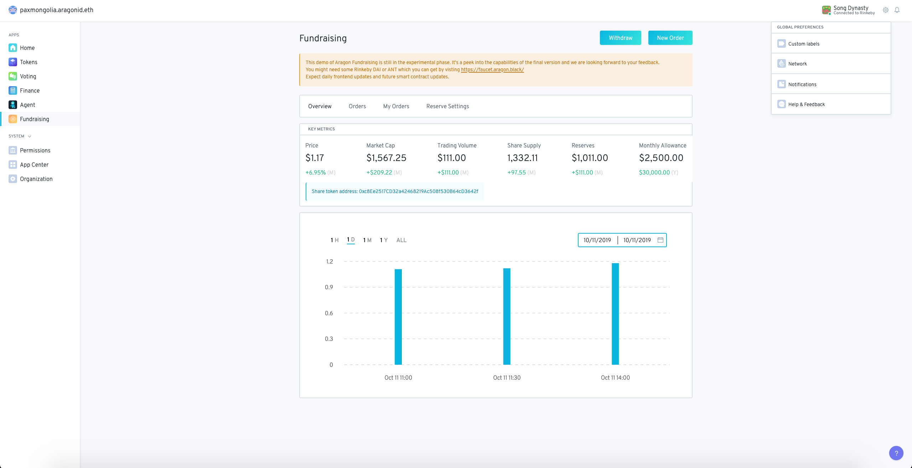

# Email Notifications

By signing up to Aragon Notifications you can configure notification triggers such as when the beneficiary address is modified, the presale closes etc...

Click on notifications button within the top right settings view and verify your email. You can then select the app and event that triggers an email being sent:

