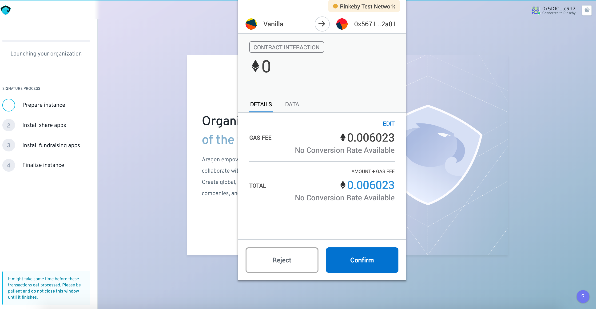
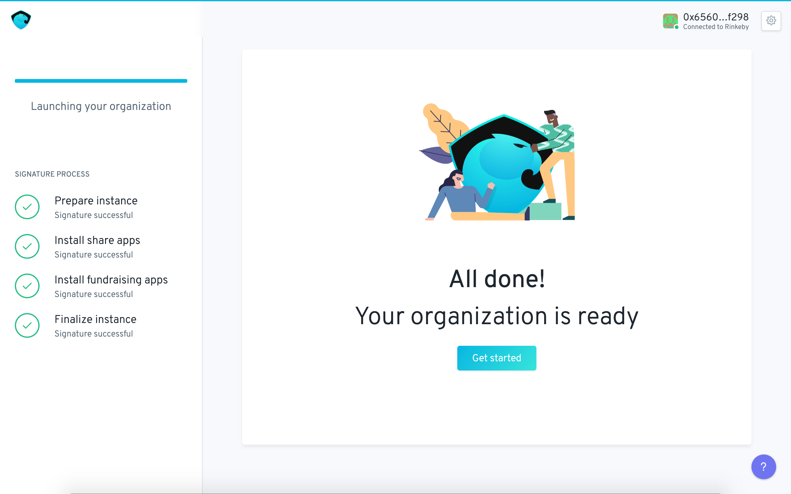

# Configuring the Presale campaign

Fundraising allows  projects to setup an initial pre-sale campaign as this:

 a\) Guarantees a minimum reserve and tap amount

b\) Levels the playing field between initial entrants and stakeholders 

c\) Offers transparency and equal opportunity for fundraising campaigns

d\) Automates curve initialisation by testing campaign metrics against minimum terms

The pre-sale screens allow for configuration of pre-sale terms.

**The terms covered  are fields to be completed to configure a fundraising campaign:**

_**Overview**_

**Presale Terms**

* **Target Goal:** The amount of DAI the presale campaign must collect in order for the curve to be initialized.
* **Price:** This is the price at which patrons participating in the presale will purchase the DAO's tokens. This ensures a level playing field by providing equal price to all participants in the pre-sale phase. This price is computed automatically according to the trading terms detailed below.
* **Funding Period:** How long the presale campaign lasts. If the target goal is not reached funds are reimbursed to patrons. If the target is reached before the limit the pre-sale closes and the curve can be initalized.
* **Initial tokens offered:** The percentage of the initial shares supply that will be offered during the presale. The remainder of this supply will be minted and sent to the board multisig if and when presale succeeds.
* **Presale Funding:** The percentage of the presale goal that will be sent to the board multisig if and when presale succeeds. The remainder of the contributed funds will be sent to the market maker's reserve pool to support trading.

**Investment Terms**

* **Vesting Schedule:** Tokens that are purchased in the presale can be vested over time to prevent immediate trading. The vesting schedule field denotes the number of days before the tokens are released to patrons.
* **Cliff Period:** After how long share tokens start vesting to pre-sale stakers.

**Trading Terms**

* * **Initial Price per share:** The starting trading price of the bonded token once the curve is initialized.
  * **Expected Growth:** For computation purposes a maximum market cap must be specified. When the max market cap is reached trading is still possible but the price stops increasing. 

    This is a multiple of the initial market cap and for all intents and purposes it can be set up to an unrealistically high number. This can be used as a powerful feature to create a flat upper end to the curve useful for a variety of use cases.

_**Advanced**_

More advanced configuration is possible via this tab:

**Trading Terms**

**Batch Length:** This can be used to set how many Ethereum blocks a batch lasts. 

**DAI Slippage:** This is a slippage safeguard where if by the batch price differs by a higher percent than this metric the orders are cancelled and funds returned to users.

**ANT Slippage:** The same safeguard for ANT collateral.

**Initial Monthly Allocation:** Here you can configure how much collateral is sent to the tap per month \(by default the board multisig\).

**Initial Tap Floor:** This is the minimum amount of collateral in reserves where the tap is frozen until more collateral can come into the organization.  This is to prevent the curve going to zero/negative territory and provide some price stability and accountability.

We're now ready to review all these configuration informations. Each step's arrow can be clicked to expand upon a particular point for deep inspection and going back in the process for modification.

Once everything is reviewed and ready click on the "launch your organization" button. Now all you have to do is sign 4 transactions with your web 3 provider:

Congratulations you can now click get started to be taken to your Fundraising DAO!

