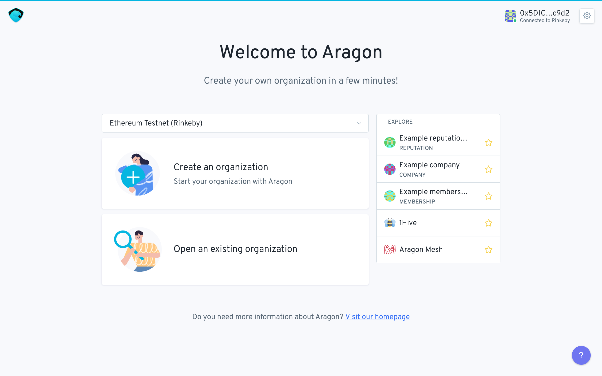
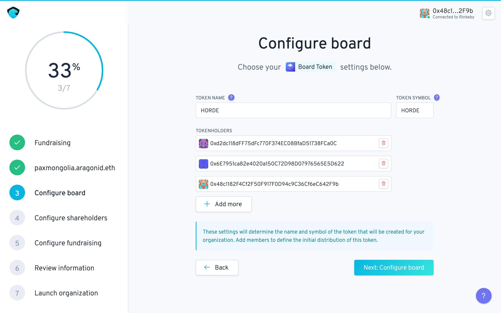
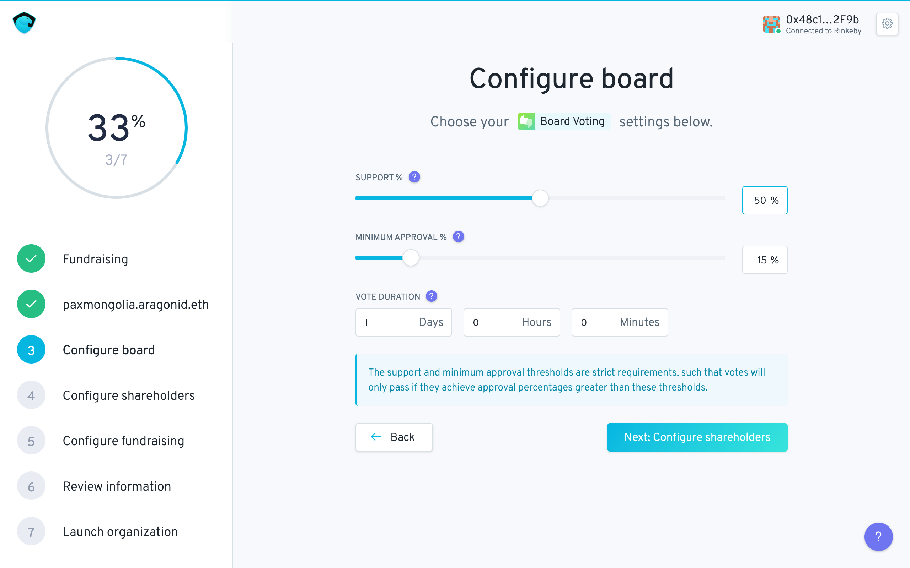
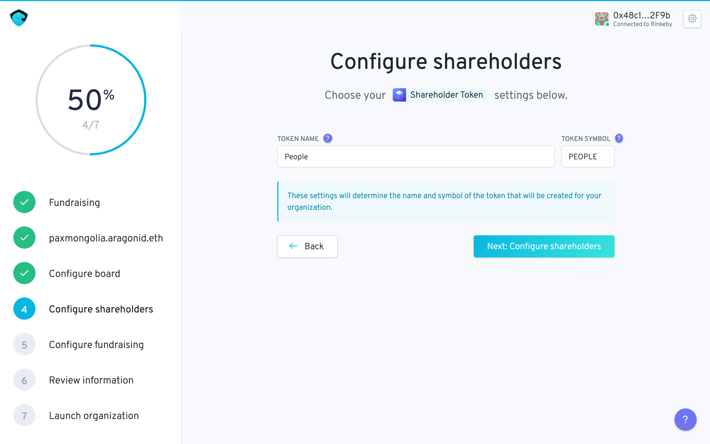
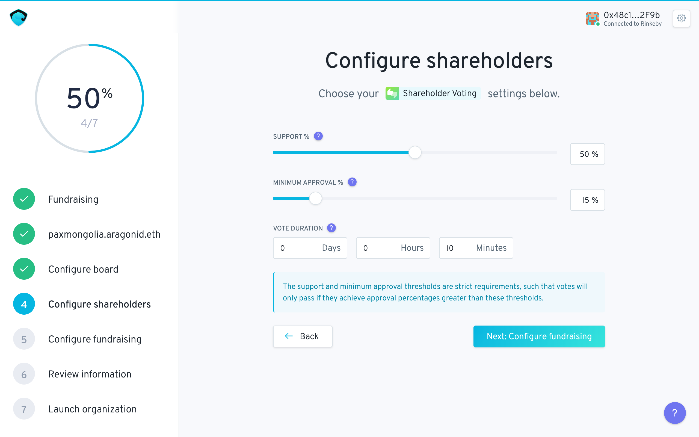

# Setting up a Fundraising DAO

To set up a fundraising type DAO go to [https://nightly.aragon.org/\#/](https://nightly.aragon.org/#/) 

Click on the “Create a new organization” button while connected to the Rinkeby network.

You can then select the Fundraising Template.

The following screen displays basic information about the Fundraising template and lists the default apps.  

The next step is to claim a domain for the organization:

This allows access to the DAO \(via the Ethereum Name Service\) where any user can input that URL address in their browser. A green checkmark shows DAO name availability.

Some info about the functioning of the organization's board:

Which can be configured here:

The board token name and symbol can be chosen as well as the list of initial board member token holders with 1 token per member. Members can be added \(with a flexible number of issued tokens\) and removed later on by a vote of existing board token holder. To note that this token is non-transferable.

This screen allows for configuring the voting app of board tokenholders:

* Support denotes the percent of expressed votes for a vote to pass. 
* Minimum approval is the minimum % of positive votes in terms of the total supply of tokens for a vote to be considered valid.
* Vote duration is the amount of time a vote remains open.

Next up some info about the organization's shareholder governance.

Shareholder token name and symbol is configured: 

And similarly we configure the shareholder's voting app:

The next section will detail the rest of the setup with the pre-sale configuration.

