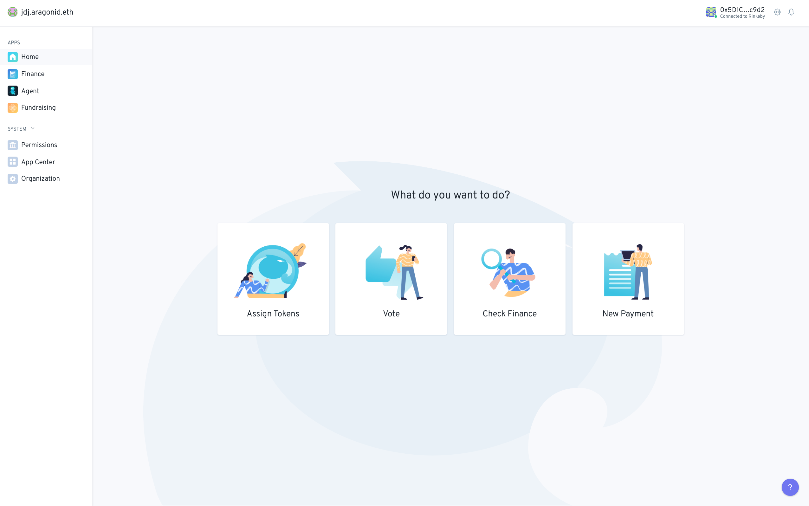
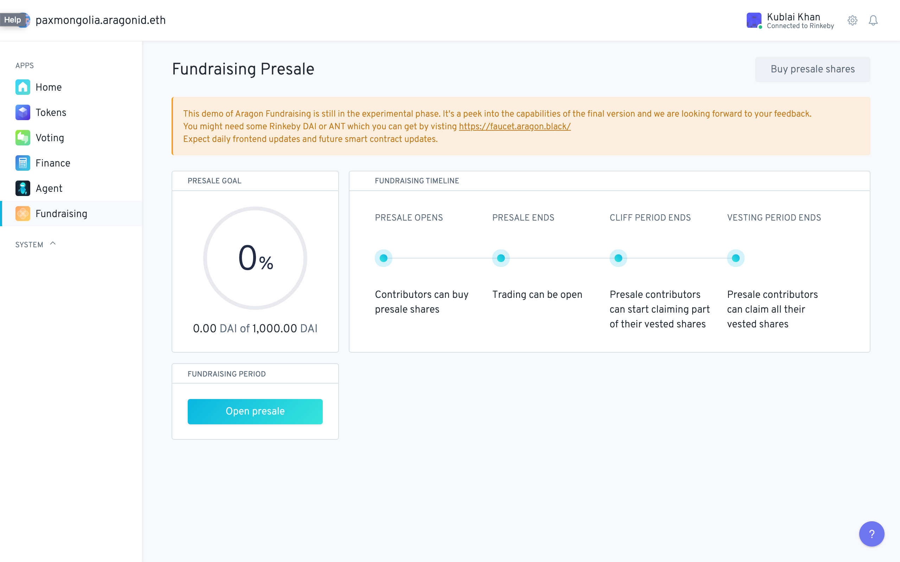
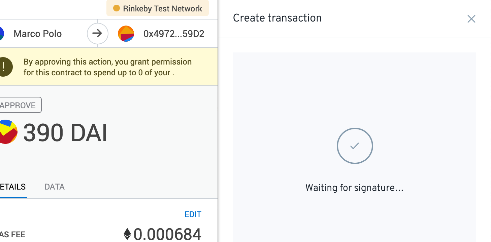
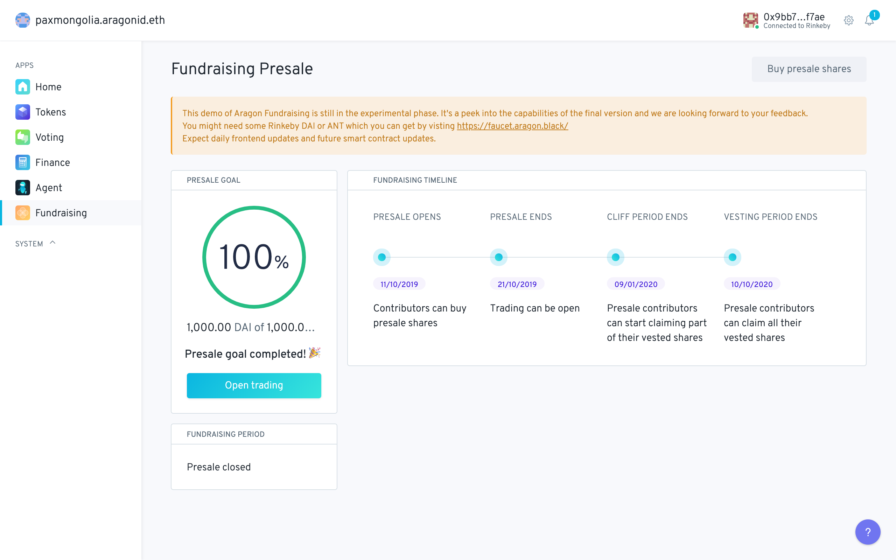

# Initiating and participating in the Presale campaign

Welcome to your DAO! Let's just head out to the Fundraising app for now by clicking on its name and logo.

We can see a screen displaying basic information of the fundraising presale that is left blank until the presale is opened.

You can also find Aragon Fundraising test network tokens at [https://faucet.aragon.black/](https://faucet.aragon.black/). Just click the button, wait for your web3 provider to initiate a transaction and sign it. you can then copy  the address shown under the button and paste it into the "add custom token" contract field in Metamask \(or other provider\) to receive your test DAI and ANT.

A board member must click the "Open Presale" button and sign a transaction:

Board token holders can then vote on the proposal to open the presale by clicking on the proposal and signing a transaction:

If by the end of the board voting period a majority of board token members have voted "Yes" the presale campaign opens:

The presale then starts and Fundraising Period window shows the time remaining in the presale while Fundraising timeline displays various informations relating to the presale, cliff and vesting start and end points.

At this point patrons can buy presale tokens by clicking on the "Buy Presale Tokens" button. This will open a side panel where the patreon can input the amount of contribution tokens \(DAI and ETH\)  they want to spend in return for shareholder tokens. By inputting various amounts of contribution tokens the Fundraising app computes the corresponding amount of SHARE token based on the configured presale price:

Patrons can then can click on "buy presale shares" and initiate a transaction to purchase the presale tokens by signing a transaction:

Presale contribution status can be check in the notifications panel on the top right corner of the client. Clicking on the notification leads to the Etherscan transaction page.

As patrons contribute tokens the Fundraising Goal is updated over time to reflect this:

When 100% of the target has been reached the bonding curve can then be initiated by clicking on "Open Trading"  signing a transaction 

